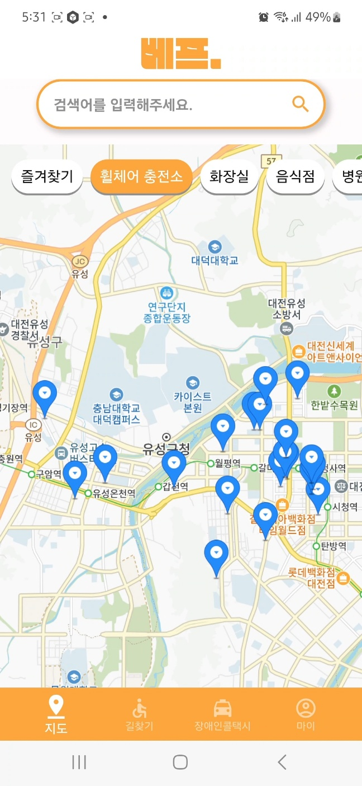
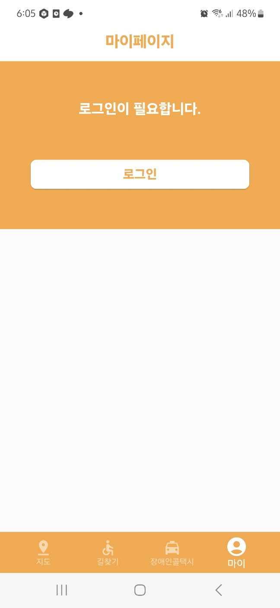
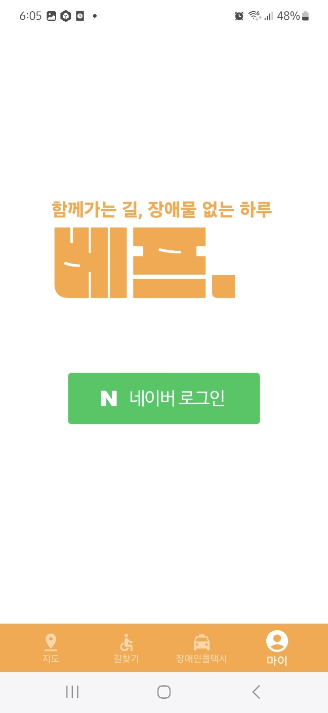
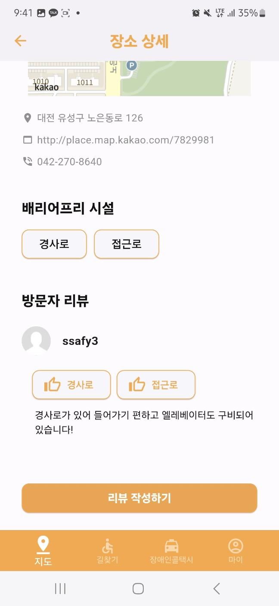
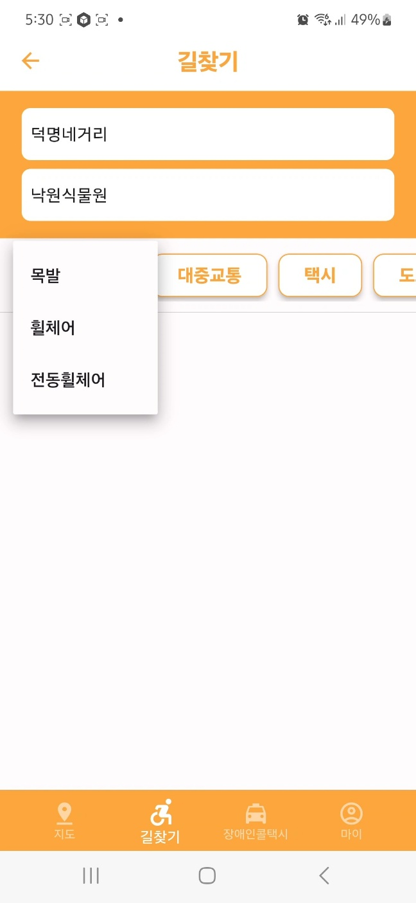
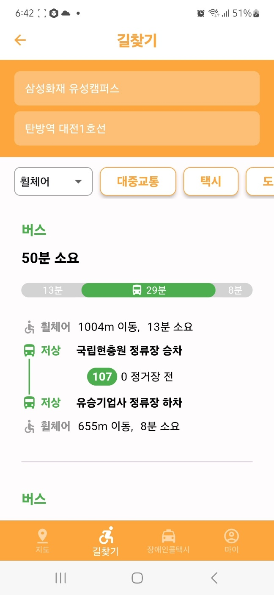
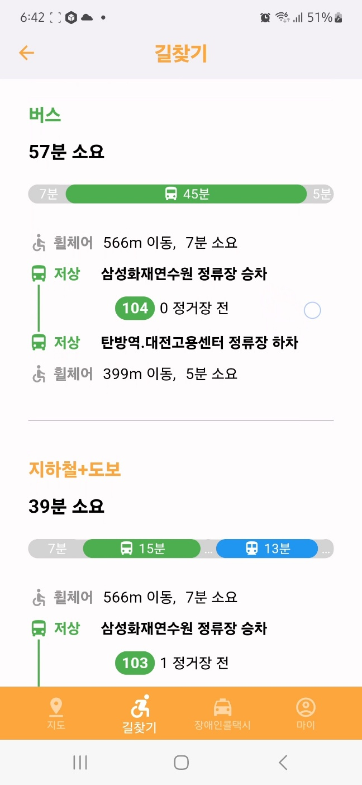
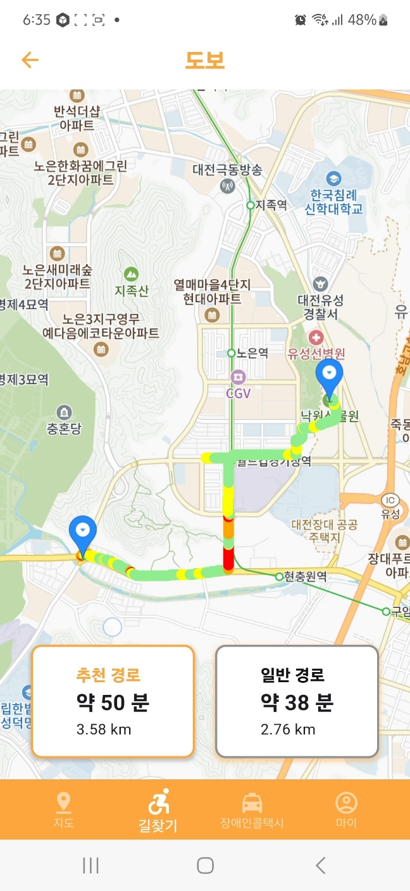
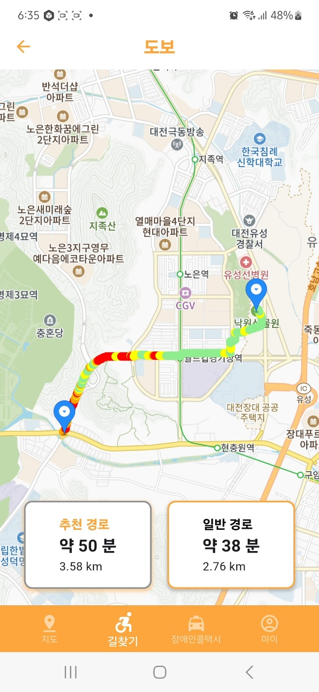

## 1. 개발 환경

### [프론트]

- **Flutter:** 3.19.3
- **Dart**:  3.3.1
- **Intellj:** 2023.3.2

### [백엔드]

- **jdk**: 17
- **Springboot:** 3.2.3
- **Mysql:** 8.3.0
- **Redis:** 7.2.4
- **AWS S3**
- **Intellij:** 2023.3.2

## 2. 설정 파일(.Ignore)

### [프론트]

- **.env**

```bash
APP_KEY = 
REST_API_KEY =  
```

### [백엔드]

- **application.yml**

```bash
spring:
  datasource:
    driver-class-name: com.mysql.cj.jdbc.Driver
  profiles:
    include: secret, dev
  servlet:
    multipart:
      max-file-size: 50MB
      max-request-size: 50MB
  jpa:
    properties:
      hibernate:
        # show_sql: true # sysout 단계에서 쿼리문을 날린다
        format_sql: true
        default_batch_fetch_size: 1000  # select 배치 조회 크기
logging:
  level:
    org.hibernate.SQL: debug
    org.hibernate.type: trace # log 단계에서 쿼리문을 나타낸다 !

server:
  servlet:
    context-path: '/api'
cloud:
  aws:
    bucket: hbaf
    region:
      static: ap-northeast-2
    stack:
      auto: false
```

- **application-secret.yml**

```bash
api:
  kakaoMap:
    key: <카카오 지도 키>
  tmap:
    key: <티맵 키>
  tago:
    key: <공공데이터 포털 인코딩 키 - 버스 위치 tago 데이터>
  data:
    route:
      key: <공공데이터 포털 인코딩 키 - 버스 경로 데이터>
    bus:
      key: <공공데이터 포털 인코딩 키 - 버스 정보 데이터>
  odSay:
    key: <odsay 키>
  google:
    key: <구글 지도 키>
cloud:
  aws:
    region:
      static: ap-northeast-2
    bucket: <S3 버킷 이름>
    credentials:
      access-key: <S3 버킷 access-key>
      secret-key: <S3 버킷 secret-key>
jwt:
  secret-key: <jwt 시크릿 키>

oauth:
  naver:
    client-id:<naver developers에 등록한 Client ID>
    client-secret: <naver developers에 등록한 Client Secret>
    url:
      base: https://nid.naver.com/oauth2.0
      callback: <naver developers에 등록한 Callback url>
      auth: https://nid.naver.com
      api: https://openapi.naver.com
spr
  datasource:
    driver-class-name: com.mysql.cj.jdbc.Driver
    username: <사용자 계정>
    password: <사용자 계정 비밀번호>

```

## 3. 환경 설정

### [프론트]

- Flutter

```bash
 flutter pub get
 flutter clean build 
 flutter app build #aab 파일 생성
 flutter build apk #apk 파일 생성
```

### [백엔드]

**ec2 내에서 테스트**

- **밑에 있는 docker-compose.yml을 원하는 폴더에 생성 후 실행**

```bash
mkdir backend # 폴더 생성
docker pull jeeni/docker-test:latest # 스프링부트 백엔드 이미지 다운로드
sudo vi docker-compose.yml # 컴포즈 파일 생성 - 밑에 docker-compose 값 복사붙여넣기
sudo vi init.sql # 초기 데이터 파일 생성 - 밑에 init.sql 값 복사붙여넣기(또는 filezilla 이용)
sudo vi mysql.env # mysql env 파일 생성 - 밑에 mysql.env 값 복사붙여넣기
docker-compose up # 실행
```

**<파일>**

- **docker-compose.yml 파일**

```bash
version: '3.3'
services:
  web:
    image: jeeni/docker-test:latest
    ports:
      - "8080:8080"
    container_name: springboot-backend
    restart: always
    depends_on:
      - mysql-db
      - redis-db
  mysql-db:
    image: mysql:latest
    container_name: mysql-db
    ports:
      - "3306:3306"
    env_file:
      - ./mysql.env
    volumes:
      - ./init.sql:/docker-entrypoint-initdb.d/init.sql
    restart: always
  redis-db:
    image: redis:latest
    container_name: redis-db
    hostname: redis
    ports:
      - "6379:6379"

```

- **초기 데이터 세팅 - init.sql → DB 덤프 파일**
  *`src/main/resources/init.sql`*
- **mysql.env**

```bash
MYSQL_ROOT_PASSWORD=<mysql root password>
MYSQL_DATABASE=fullship
```

## 4. 외부 API

### [로그인]

- **네이버 로그인**
    - https://developers.naver.com/docs/login/devguide/devguide.md

### [공공데이터포털]

- **국토교통부_(TAGO)_버스위치정보**
    - https://www.data.go.kr/tcs/dss/selectApiDataDetailView.do?publicDataPk=15098533
- **한국사회보장정보원_장애인편의시설 현황**
    - https://www.data.go.kr/tcs/dss/selectApiDataDetailView.do?publicDataPk=15092317
- **대전광역시_버스 위치정보 조회 서비스**
    - https://www.data.go.kr/tcs/dss/selectApiDataDetailView.do?publicDataPk=15058247

### [지도]

- OdSay
    - https://lab.odsay.com/
- SK Open api
    - https://openapi.sk.com/products/detail?svcSeq=4&menuSeq=1
- kakao map
    - https://apis.map.kakao.com/android_v2/
- google map
    - https://developers.google.com/maps?hl=ko


### [이미지]

- AWS S3
    - https://aws.amazon.com/ko/?nc2=h_lg


## 5. 화면

 |
--- | --- | 
 |
 |
 |
 |
 |
 |
